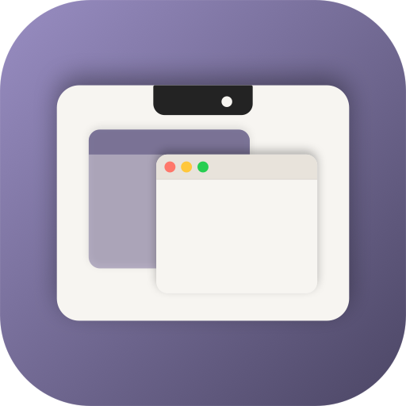

<div align="center">



# Quiet Notch

**Turn your MacBook's notch into a dynamic control center.**

A native macOS menu bar app that transforms the notch into a music player, file shelf, calendar, system HUD, charging indicator and more — so the empty black bar at the top of your screen finally earns its keep. Part of the [Quiet Apps](https://github.com/quietapps) family.

[](https://www.apple.com/macos/)
[](https://swift.org)
[](https://developer.apple.com/xcode/swiftui/)
[](LICENSE)
[](https://github.com/quietapps/QuietNotch/releases)
[](https://github.com/quietapps/QuietNotch/releases)
[](https://github.com/quietapps/QuietNotch/stargazers)

[Download](#installation) · [Features](#features) · [Usage](#usage) · [Build from source](#build-from-source) · [Contributing](#contributing) · [FAQ](#faq)

<p>
  
</p>

</div>

---

## Why

Apple gave you a notch and forgot to give it a job. Quiet Notch fills the gap. Hover the notch to expand it into a glassy control surface; the active track, your next calendar event, a charging readout, an AirDrop-aware file shelf and the macOS HUDs all live there. When you don't need it, the notch disappears back into the bezel — no menu bar clutter, no extra windows.

Forked from the Boring Notch lineage. Rebuilt and re-branded for the Quiet Apps family. **Free and open source under MIT.**

## Features

### Music control center
- Live now-playing card with album art, scrubber, transport buttons + track info
- Real-time audio visualizer that reacts to playback
- Apple Music, Spotify, YouTube Music + every app that uses the macOS Now Playing protocol
- "Sneak peek" thumbnail when tracks change while the notch is closed
- Slot configuration — pin a preferred player, choose ordering when multiple are active

### Live activities & HUDs
- **System HUD replacement** — volume, brightness and keyboard backlight render inside the notch instead of the stock macOS chunk
- **Charging indicator** with real-time percentage and animated battery state
- **Open Notch HUD** — optional always-visible battery percentage inside the closed notch
- Download progress live activity (Safari, Chromium browsers, Firefox where supported)
- AirDrop / Quick Share live activity
- Mirror — flip your front-facing camera into the notch for a glance check

### Shelf
- Drag any file onto the notch to stash it in a temporary shelf
- AirDrop, Quick Share, copy and Quick Look without leaving the shelf
- Per-item bookmarks survive across launches
- Optional auto-remove + expanded drag detection zone
- Configurable share provider, tap-to-open and copy-on-drag behaviors

### Calendar
- Inline upcoming events surfaced from the system Calendar
- Reminders integration
- Notch-sized layout tuned to read at a glance

### Customization
- **App icon picker** — pick the default brand mark or the original Boring Notch–era "Classic" icon, switches the Dock + App Switcher icon live
- Notch height tuning on real-notch displays + non-notch displays (match menu bar, match real notch, or custom slider)
- Per-display preferences — pin Quiet Notch to one screen, show on all screens, or auto-switch to the active display
- 15+ gesture, hover and tap tunables (sensitivity, hover dwell, open-on-hover, gestures on/off)
- Slider color follows album art, system accent, or stays neutral white
- Show on lock screen (off by default), launch at login, menu bar icon visibility
- Keyboard shortcut bindings for every major action via [KeyboardShortcuts](https://github.com/sindresorhus/KeyboardShortcuts)

### Native macOS feel
- Menu bar agent — no Dock icon
- SwiftUI Settings window with tabbed nav, search-friendly forms, and live-preview where it matters
- Onboarding flow with permission helpers (Accessibility, Calendar, Camera as needed)
- Sparkle auto-updater (signed appcast)
- XPC helper for privileged Accessibility operations
- Localized — community translations via [Crowdin](https://crowdin.com/project/quiet-notch)

## Installation

> **Note:** Quiet Notch is not yet code-signed with an Apple Developer ID. macOS Gatekeeper will warn on first launch. The steps below work around it. A signed/notarized build is on the roadmap.

### Homebrew (recommended)

```bash
brew install --cask quietapps/quietnotch/quietnotch
```

The cask strips the macOS quarantine attribute on install so Gatekeeper does not block launch.

### Direct download

1. Grab `QuietNotch.dmg` from the [latest release](https://github.com/quietapps/QuietNotch/releases/latest)
2. Open the `.dmg` → drag **Quiet Notch** into `/Applications`
3. Strip the quarantine attribute:

   ```bash
   xattr -dr com.apple.quarantine "/Applications/Quiet Notch.app"
   ```

4. Launch Quiet Notch
5. Grant **Accessibility** access when prompted (System Settings → Privacy & Security → Accessibility). Grant Calendar / Camera if you want those live activities.

### Heads-up about unsigned builds

- The Homebrew cask strips every extended attribute and re-registers the bundle with Launch Services on install, so the app should launch on a clean Mac out of the box.
- If a double-click does nothing on first launch, this is Gatekeeper silently blocking the unsigned binary. Fix once: Finder → `/Applications` → right-click **Quiet Notch.app** → **Open** → **Open** in the warning dialog. macOS remembers your choice afterward.
- After every new release you may need to **remove + re-add Quiet Notch** in System Settings → Privacy & Security → Accessibility. macOS ties the permission to the app's code-signature hash, and unsigned builds change hash each time.
- If Gatekeeper still won't let the app run, open **System Settings → Privacy & Security**, scroll to the message about Quiet Notch, click **Open Anyway**.

## Updating

### Homebrew

```bash
brew update
brew upgrade --cask quietnotch
```

After upgrading, if Quiet Notch stops detecting media or input:

1. Open **System Settings → Privacy & Security → Accessibility**
2. Select **Quiet Notch** in the list and click **−** to remove it
3. Click **+**, add `/Applications/Quiet Notch.app` again, and enable the toggle

A signed release will eliminate this step.

### Direct download

Download the newer DMG from [Releases](https://github.com/quietapps/QuietNotch/releases), drag the new `Quiet Notch.app` over the old one in `/Applications`, run `xattr -dr com.apple.quarantine "/Applications/Quiet Notch.app"`, then re-grant Accessibility as above.

## Uninstalling

### Homebrew

```bash
# Remove the app and its preferences (via the cask's zap stanza)
brew uninstall --cask --zap quietnotch

# Drop the tap
brew untap quietapps/quietnotch

# Purge Homebrew's download cache + old logs
brew cleanup --prune=all -s
```

### Direct download

```bash
# Move the app to Trash
rm -rf "/Applications/Quiet Notch.app"

# Remove saved settings + caches
defaults delete app.quiet.QuietNotch 2>/dev/null
rm -rf ~/Library/Preferences/app.quiet.QuietNotch.plist \
       ~/Library/Application\ Support/Quiet\ Notch \
       ~/Library/Caches/app.quiet.QuietNotch \
       ~/Library/HTTPStorages/app.quiet.QuietNotch \
       ~/Library/Saved\ Application\ State/app.quiet.QuietNotch.savedState
```

Then remove **Quiet Notch** from **System Settings → Privacy & Security → Accessibility**.

### Verify it's fully gone

```bash
ls /Applications | grep -i notch    # empty
brew list --cask | grep -i notch    # empty (Homebrew users)
brew tap | grep -i notch            # empty (Homebrew users)
```

## Usage

| Action | How |
|---|---|
| Expand the notch | Hover the notch area |
| Open Settings | Click the ✦ menu bar icon → **Settings**, or ⌘, with the app focused |
| Switch active media slot | Drag-tap inside the music card, or use the slot picker in Settings |
| Drop a file on the shelf | Drag any file onto the notch — it expands automatically |
| AirDrop / Quick Share | Tap the share icon on any shelf item |
| Restart | Menu bar icon → **Restart Quiet Notch** |
| Quit | Menu bar icon → **Quit** (⌘Q while menu open) |

### Picking an app icon

Settings → General → **App icon**. Pick **Default** (Quiet Apps brand mark with the notch) or **Classic** (the original Boring Notch icon, kept for nostalgia). The Dock + ⌘-Tab icon swaps live; the Finder icon updates on next launch.

### Menu bar icon

A ✦ sparkle by default. Toggle it off in Settings → General → **Show menu bar icon** — you'll still reach Settings by clicking the notch.

## Permissions

Quiet Notch can ask for several permissions depending on which features you enable:

- **Accessibility** — required for HUD replacement, gesture detection and media key handling
- **Calendar** — required to show upcoming events inside the notch
- **Camera** — required for the Mirror live activity
- **AppleEvents** — required to drive Music / Spotify / Browsers

On first launch you'll see an onboarding flow that links straight to the right System Settings panes. The app polls for permission and switches the relevant feature on the moment access is granted — no restart needed.

> **Heads up:** macOS ties Accessibility permission to the app's **code signature**. If you rebuild Quiet Notch from source the signature changes and the old permission entry no longer matches. Fix: remove Quiet Notch from the Accessibility list and add it again. Signed release builds don't have this problem.

## Build from source

### Requirements
- macOS 14.0 (Sonoma) or later
- Xcode 16.0 or later

### Steps

```bash
git clone https://github.com/quietapps/QuietNotch.git
cd QuietNotch
open QuietNotch.xcodeproj
```

Hit ⌘R in Xcode. Or from the command line:

```bash
xcodebuild -project QuietNotch.xcodeproj -scheme QuietNotch -configuration Release build
```

The built `.app` lands in `~/Library/Developer/Xcode/DerivedData/QuietNotch-*/Build/Products/Release/`.

### Project layout

```
QuietNotch/
├── QuietNotchApp.swift          # entry point + AppDelegate
├── managers/                    # MusicManager, CalendarManager, BrightnessManager, etc.
├── MediaControllers/            # Apple Music, Spotify, YouTube Music, NowPlaying
├── components/
│   ├── Notch/                   # NotchWindow, NotchShape, Header, ExtrasMenu
│   ├── Music/                   # Visualizer, Lottie animations
│   ├── Live activities/         # Battery, Download, InlineHUD, OpenNotchHUD
│   ├── Shelf/                   # Drop service, models, view models, views
│   ├── Calendar/                # QuietCalendar
│   ├── Settings/                # SettingsView, AppIconPicker, panels
│   └── Onboarding/              # Permission requests, welcome flow
├── models/                      # ViewModel, Constants (Defaults keys), PlaybackState
├── enums/                       # generic.swift (DownloadIconStyle, AppIconChoice, …)
├── extensions/                  # KeyboardShortcuts helper, NSScreen UUID, etc.
├── XPCHelperClient/             # Client for the privileged XPC helper
└── Assets.xcassets/             # AppIcon, ClassicAppIcon, palette
QuietNotchXPCHelper/             # Out-of-process helper (Accessibility auth, etc.)
mediaremote-adapter/             # MediaRemoteAdapter framework
Configuration/dmg/               # Release DMG builder script
updater/                         # Sparkle public keys
```

## Configuration

Settings live in `UserDefaults` under `app.quiet.QuietNotch`. Reset everything with:

```bash
defaults delete app.quiet.QuietNotch
```

Want to inspect a single key first? `defaults read app.quiet.QuietNotch <key>`.

## Contributing

PRs welcome. Before opening one:

1. Open an issue describing the change
2. Keep changes focused — one feature or fix per PR
3. Match the existing code style (Swift API design guidelines, no force-unwraps in new code)
4. Verify the project builds with `xcodebuild` before pushing

See [CONTRIBUTING.md](CONTRIBUTING.md) for the full guide. Translations land via [Crowdin](https://crowdin.com/project/quiet-notch).

## Roadmap

- [x] Playback live activity 🎧
- [x] Calendar integration 📆
- [x] Reminders integration ☑️
- [x] Mirror 📷
- [x] Charging indicator and current percentage 🔋
- [x] Customizable gesture control 👆🏻
- [x] Shelf functionality with AirDrop 📚
- [x] Notch sizing customization, fine-tuning per display 🖥️
- [x] System HUD replacements (volume, brightness, backlight) 🎚️💡⌨️
- [x] App icon picker 🎨
- [ ] Bluetooth live activity (connect/disconnect for Bluetooth devices)
- [ ] Weather integration ⛅️
- [ ] Customizable layout options 🛠️
- [ ] Lock-screen widgets 🔒
- [ ] Extension system 🧩
- [ ] Notifications (under consideration) 🔔
- [ ] Apple Developer ID signing + notarization (drops the `xattr` step from install)
- [ ] Upstream submission to `Homebrew/homebrew-cask`

## FAQ

**Does Quiet Notch work on non-notch Macs?**
Yes. On Macs without a real notch, Quiet Notch draws a virtual notch at the top of your screen using the height you choose in Settings → General → **Notch height on non-notch displays**.

**Does it drain battery?**
No. The notch only animates when you hover it or a live activity fires. CPU sits near zero idle.

**Does it slow down audio playback?**
No. Now Playing data is observed, never proxied — Quiet Notch just reads what the system already publishes.

**Can I use it with multiple displays?**
Yes. Settings → General → **Show on all displays**, or pin to one display, or let it auto-switch to whichever screen is active.

**Why isn't my music app showing up?**
Quiet Notch reads from the macOS Now Playing protocol via [MediaRemoteAdapter](https://github.com/ungive/mediaremote-adapter). If your player doesn't publish Now Playing info, it won't appear. Apple Music, Spotify and YouTube Music are explicitly wired up.

**Where do I change the app icon?**
Settings → General → **App icon**. Two options: the new Quiet Apps brand mark (default) or the Classic original. The Dock icon swaps live. The Finder icon updates on next launch.

**Can I change the menu bar icon?**
Toggle it off entirely in Settings → General → **Show menu bar icon**. Custom glyphs are on the roadmap.

**Why does macOS keep forgetting my Accessibility permission?**
Each unsigned build has a different code-signature hash and macOS treats it as a new app. Remove + re-add Quiet Notch in System Settings → Privacy & Security → Accessibility. A signed release will fix this for good.

**How do I quit?**
Click the menu bar icon → **Quit**, or focus the app and hit ⌘Q.

## Support

<a href="https://www.ko-fi.com/alexander5015" target="_blank"></a>

## Star history

<a href="https://www.star-history.com/#quietapps/QuietNotch&Timeline">
 <picture>
   <source media="(prefers-color-scheme: dark)" srcset="https://api.star-history.com/svg?repos=quietapps/QuietNotch&type=Timeline&theme=dark" />
   <source media="(prefers-color-scheme: light)" srcset="https://api.star-history.com/svg?repos=quietapps/QuietNotch&type=Timeline" />
   
 </picture>
</a>

## Acknowledgments

Quiet Notch stands on the shoulders of the open-source community:

- **[MediaRemoteAdapter](https://github.com/ungive/mediaremote-adapter)** — gives us access to the macOS Now Playing source on macOS 15.4+
- **[NotchDrop](https://github.com/Lakr233/NotchDrop)** — inspiration and reference for the original Shelf feature
- **[Boring Notch](https://github.com/TheBoredTeam/boring.notch)** — Quiet Notch is a continuation of this lineage; massive thanks to the original team
- **[KeyboardShortcuts](https://github.com/sindresorhus/KeyboardShortcuts)**, **[Defaults](https://github.com/sindresorhus/Defaults)**, **[Sparkle](https://sparkle-project.org)** — workhorse libraries that make the app feel native

Icon credits: [@maxtron95](https://github.com/maxtron95) (Classic). Default icon by Quiet Apps.


For a full list of licenses and attributions, see [THIRD_PARTY_LICENSES](./THIRD_PARTY_LICENSES).

## License

[MIT](LICENSE) © Quiet Apps

---

<div align="center">
If Quiet Notch makes your notch worth looking at, drop a ⭐ on the repo.
</div>
